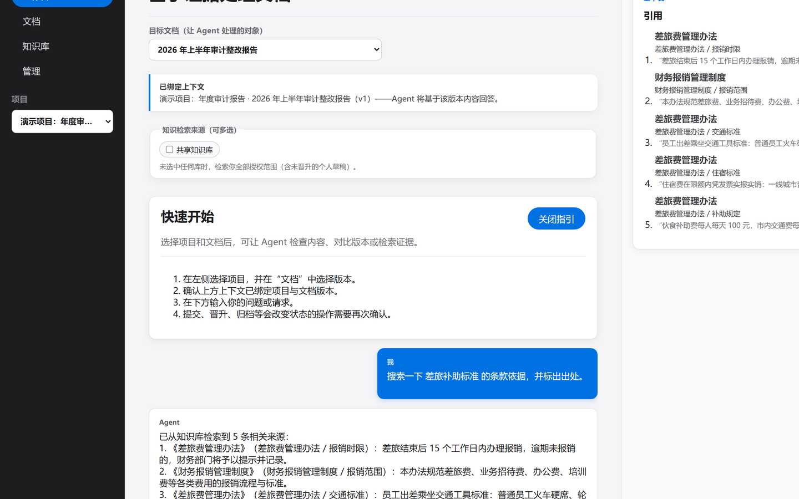
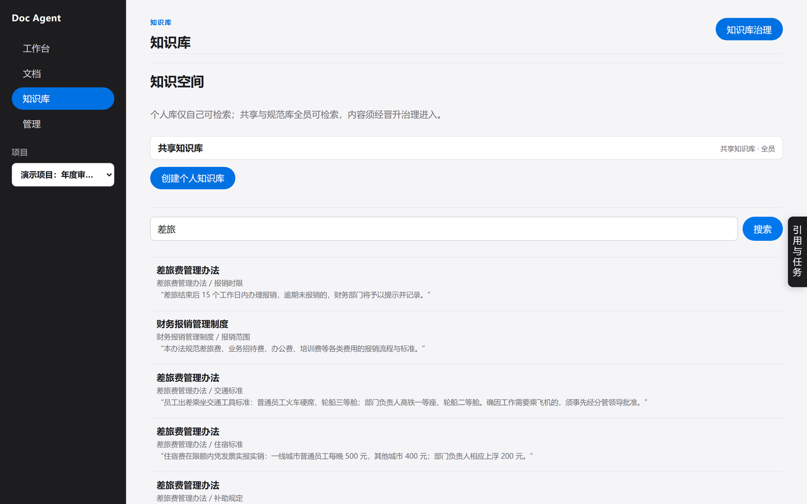
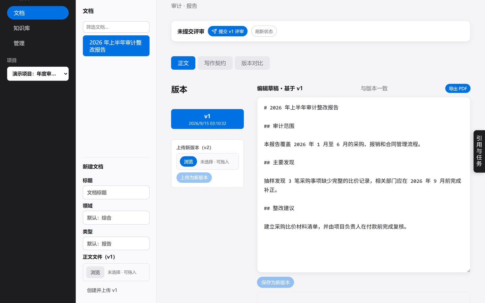
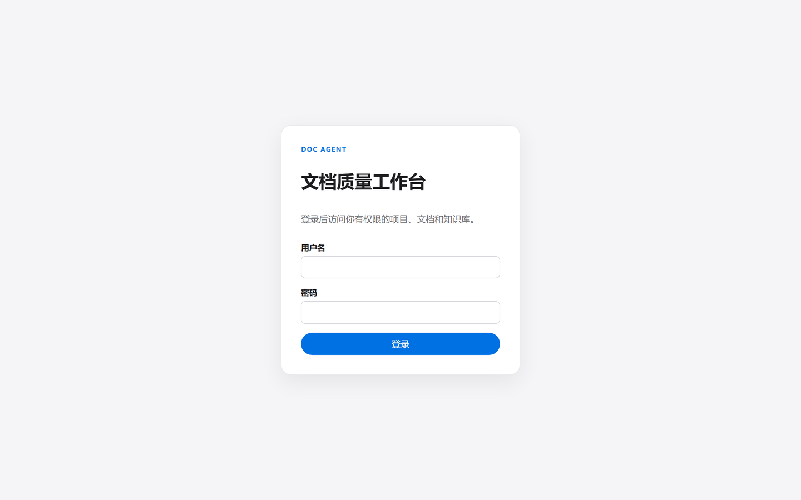

# Doc Agent · 审计文书质量工作台

[](https://github.com/sunry00710/doc-agent/actions/workflows/ci.yml)
[](LICENSE)


面向审计文书场景的文档质量工作台：项目内维护不可变文档版本，Agent 基于绑定版本做
检查 / 改写建议 / 版本对比 / 评审批注 / 起草，知识库支持检索与晋升治理，评审工作流覆盖
「提交 → 评审 → 批准 → 晋升 → 索引」全链路。演示模式（FakeProvider）离线可跑，可无网演示。

## 界面预览

| Agent 工作台（右栏是检索到的引文证据） | 知识库检索（命中片段带原文引文） |
| --- | --- |
|  |  |

| 文档版本与质量门 | 登录 |
| --- | --- |
|  |  |

## 60 秒启动（Windows）

```bash
# 1. 后端依赖（需要 uv 与 Node.js 20.19+/22.12+，Vite 要求）
uv sync

# 2. 建库建表（首次必跑：种子脚本不会自动建表）
uv run alembic upgrade head

# 3. 灌入演示数据（幂等，可重复执行）
uv run python scripts/seed_demo.py
uv run python scripts/seed_roles.py       # 补齐三角色账号（管理员/上级/下级）
uv run python scripts/seed_knowledge.py   # 8 份制度文档：知识库检索与引文演示需要

# 4. 启动后端 + 后台 worker（Ctrl+C 停止）
uv run python run_dev.py

# 5. 另开终端启动前端
npm --prefix web install
npm --prefix web run dev
```

> `run_dev.py` 启动时也会自动执行 `alembic upgrade head`，但第 3 步的种子脚本依赖表已存在。
> 全新克隆请按上面顺序执行；也可以先启动一次服务，再补跑第 3 步。

打开 `http://127.0.0.1:5173/`，用 `scripts/seed_roles.py` 输出的账号登录：

| 账号 | 密码 | 角色 | 能做什么 |
|---|---|---|---|
| `demo` | `DemoPass-2026!` | 管理员 | 管理用户与项目成员、评审、知识库治理 |
| `shangji` | `ReviewPass-2026!` | 上级 | 审核与批准下属提交、发起晋升治理 |
| `xiashu` | `StaffPass-2026!` | 下级（员工） | 编辑提交、评论、向知识库投稿 |

> 以上密码仅用于本地演示，部署到共享环境前必须更换。

### 无外网 / 无法访问 HuggingFace 时的离线演示

语义检索默认开启（`EMBEDDING_ENABLED=true`），首次建索引会从 HuggingFace 拉取
`BAAI/bge-small-zh-v1.5`。内网或无外网环境下这一步会失败，导致文档索引任务报错。
离线演示请显式关闭向量召回：

```bash
cp .env.example .env
# 编辑 .env：EMBEDDING_ENABLED=false
```

此时检索走 SQLite FTS5 关键词召回 + 引文溯源，功能可用，只是不再有向量召回
（`mode=hybrid` 在没有可用向量时退化为关键词检索）。这是有意的降级设计，不是缺陷。
若能访问镜像，也可改走镜像而不关向量：`HF_ENDPOINT=https://hf-mirror.com`。

## 常用命令

| 用途 | 命令 |
|---|---|
| 后端测试 | `uv run pytest tests/unit tests/integration tests/evaluation -q` |
| 前端测试 | `npm --prefix web test -- --run` |
| E2E 测试（自动起隔离环境） | `npm --prefix web run test:e2e` |
| 类型检查 | `cd web && npx tsc --noEmit` |
| 代码检查 | `uv run ruff check app tests` |
| 备份 / 恢复数据库 | `uv run python scripts/backup.py` / `uv run python scripts/restore.py` |

## 目录地图

```
app/
  main.py            应用装配（路由、异常、provider、工具注册表）
  core/              配置、错误信封、密码哈希
  identity/          用户与全局角色（user / reviewer / admin）、登录
  admin/             管理员接口：用户列表与角色调整
  projects/          项目、项目成员、项目级权限（contributor / reviewer / owner）
  documents/         文档与不可变版本、文件存储与校验
  reviews/           评审状态机、批注与返修
  quality/           质量工具（检查/改写/对比/评审/评判/起草）、提示词、写作契约
  knowledge/         知识空间、切块、检索（FTS+向量）、晋升治理、索引任务
  jobs/              持久化任务队列（生产端/worker/心跳/重试）
  providers/         模型接入（fake / self / internal）
web/                 React 前端（Vite + TS）
  src/app/           壳与导航、全局状态（App.tsx）
  src/features/      各功能工作面（agent/documents/knowledge/reviews/comparison/management…）
  e2e/               Playwright E2E（自起隔离后端+前端+worker，独立端口）
tests/               后端测试（unit / integration / evaluation）
scripts/             种子、账号、备份、交付打包脚本
docs/                使用手册、架构说明、运维 runbook、历次交接文档
```

## 关键约定（新人必读）

- **不可变版本**：文档版本一经创建不可修改（`DocumentVersion` 有 before_update 钩子拒绝更新）；
  修改 = 上传新版本。
- **确认-执行**：Agent 的变更类工具必须带 `confirmed=true` + 幂等键才执行；
  幂等存储在应用级 ToolRegistry 上（跨请求生效）。
- **上传即入队**：上传新版本会在同一事务里给 `knowledge.ingest` 任务入队（幂等键 = 版本 ID），
  由 worker 异步建索引。worker 未运行时上传仍成功、Job 面板显示「排队中」，
  启动 worker 后自动补偿。
- **权限双层**：全局角色（admin/reviewer/user）× 项目角色（owner/reviewer/contributor），
  后端 `require_project_permission` 是唯一权威，前端只做入口显隐。
  全局角色判断必须经 `app/identity/roles.py` / `web/src/app/roles.ts`（多角色演进接缝）。
- **模型接入**：`MODEL_PROVIDER=fake|self|internal`；fake 为离线演示（语义对比自动降级为
  启发式并如实标注引擎），接真实模型配 `.env`（见 `.env.example`）。

## 文档索引

> 第一次接手：先读 **[`docs/先阅读-从这里开始.md`](docs/先阅读-从这里开始.md)**（文件地图与阅读顺序）。

| 文档 | 内容 |
|---|---|
| `docs/先阅读-从这里开始.md` | **接手入口**：按顺序读什么、部署形态速查、安全清单 |
| `docs/使用手册.md` | 三角色操作手册 + 完整演示脚本 |
| `docs/架构说明.md` | 模块地图、数据流、关键机制细节 |
| `docs/部署指南.md` | **服务器/内网部署**：systemd、nginx、升级、备份、安全清单 |
| `docs/开发指南.md` | **下一步开发**：代码约定、扩展步骤（加端点/工具/任务/迁移）、优先待办、技术债 |
| `docs/多角色迁移方案.md` | 「一人兼多角色」迁移方案（角色判断已收敛到 roles.py / roles.ts） |
| `docs/运维手册.md` | 备份恢复、日志、常见故障处理 |
| `docs/交付记录-2026-09-11.md` | 本次交付的完整改动与验证记录 |
